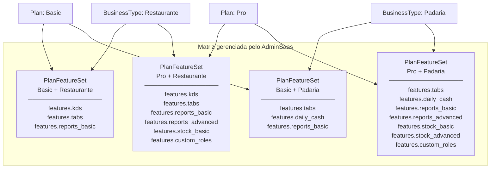
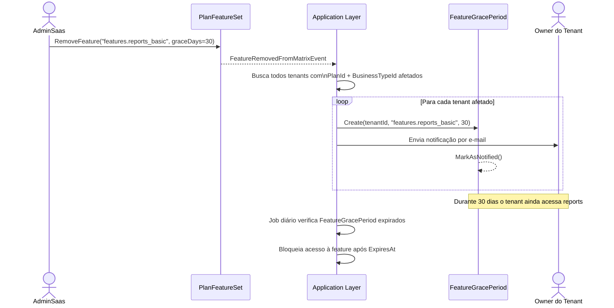
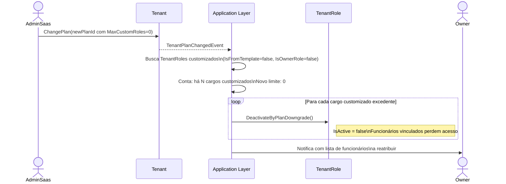
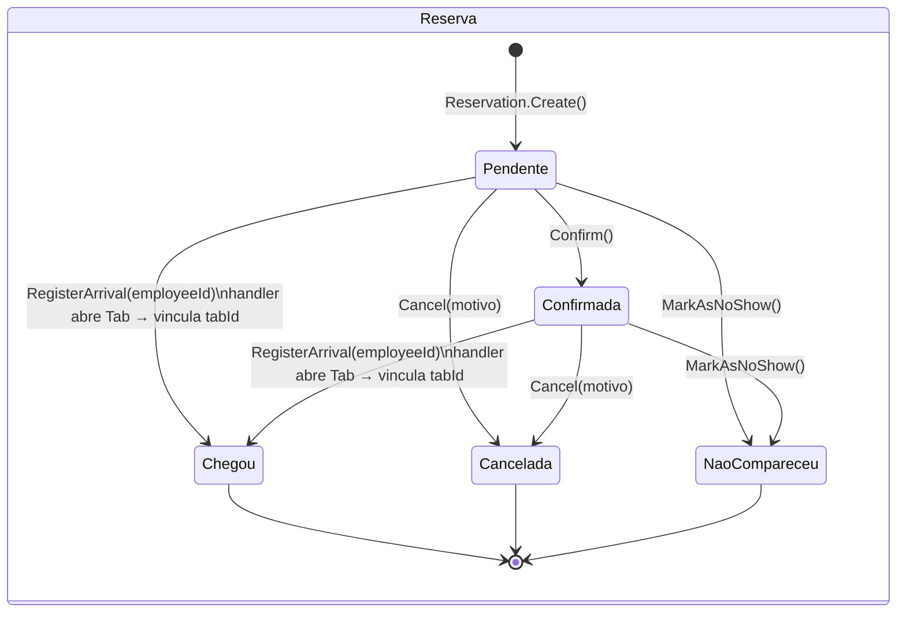
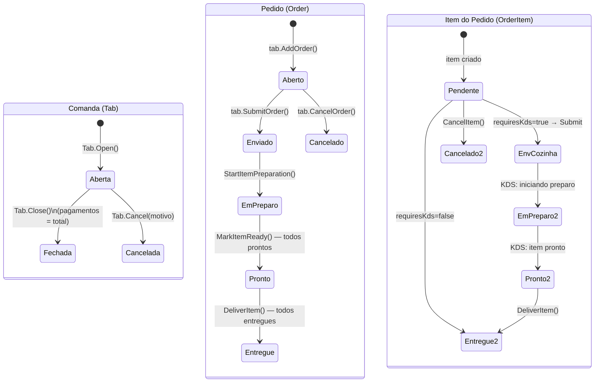

# Diagramas do Domínio — Mangefy

> Abra em qualquer editor com suporte a Mermaid (VS Code + extensão, GitHub, Notion) ou cole em https://mermaid.live

---

## Mapa Visual Geral do Domínio

```mermaid
graph TB

    %% ── ESTILOS ──────────────────────────────────────────────────
    classDef platform  fill:#7C3AED,color:#fff,stroke:#5B21B6,rx:8
    classDef tenant    fill:#0369A1,color:#fff,stroke:#075985,rx:8
    classDef operation fill:#065F46,color:#fff,stroke:#064E3B,rx:8
    classDef config    fill:#92400E,color:#fff,stroke:#78350F,rx:8
    classDef schedule  fill:#1D4ED8,color:#fff,stroke:#1E3A8A,rx:8
    classDef stock     fill:#B45309,color:#fff,stroke:#92400E,rx:8
    classDef extra     fill:#9D174D,color:#fff,stroke:#831843,rx:8

    %% ── PLATAFORMA (AdminSaas) ───────────────────────────────────
    subgraph PLATAFORMA["🏢  Plataforma  (AdminSaas)"]
        direction TB
        P1["📦 Plan\n───────\nNome · Preço\nLimites · MaxCustomRoles"]
        P2["🏪 BusinessType\n───────\nTipo de Negócio\n+ RoleTemplates"]
        P3["🔑 PlanFeatureSet\n───────\nMatriz Plano × Tipo\nFeatures habilitadas"]
        P4["⏳ FeatureGracePeriod\n───────\nCarência 30 dias\npor tenant"]
        P5["🏷️ SupplierCategory\n───────\nRamo de atuação\nGlobal ou por tenant"]
        P6["🚚 PlatformSupplier\n───────\nCatálogo global\nSomente leitura"]
    end

    %% ── TENANT ───────────────────────────────────────────────────
    subgraph TENANT["🍽️  Tenant  (Estabelecimento)"]
        direction TB
        T1["🏠 Tenant\n───────\nNome · Slug · E-mail\nPlano · Tipo · Timezone"]
        T2["👤 Employee\n───────\nNome · E-mail · Senha\nCargo · Status\nAcesso Temporário"]
        T3["🎭 TenantRole\n───────\nCargo · Permissões\nOwner / Template / Custom"]
    end

    %% ── OPERAÇÃO ─────────────────────────────────────────────────
    subgraph OPERACAO["🧾  Operação"]
        direction TB
        O1["🪑 Table\n───────\nNúmero · Capacidade\nSetor · Status"]
        O2["📋 Tab  (Comanda)\n───────\nNúmero físico · Cliente\nMesa · Pedidos · Pagamentos"]
        O3["🍳 Order  (Pedido)\n───────\nRound de itens\nEnviado à cozinha"]
        O4["🥗 OrderItem\n───────\nSnapshot nome+preço\nQuantidade · Status"]
        O5["💳 Payment\n───────\nValor · Método\nMúltiplos por comanda"]
        O6["🗂️ Menu\n───────\nIsDefault · Schedule\nCategorias → Itens\nFicha Técnica"]
    end

    %% ── ESTOQUE ──────────────────────────────────────────────────
    subgraph ESTOQUE["📦  Estoque"]
        direction TB
        S1["🗄️ Stock\n───────\nEstoque global\nfiltro por setor"]
        S2["🧂 StockItem\n───────\nQtd · Mínimo · Custo\nFornecedor · Setor"]
        S3["📊 StockMovement\n───────\nCompra · Venda\nPerda · Ajuste"]
        S4["🚚 Supplier\n───────\nFornecedor do tenant\nManual ou do catálogo"]
    end

    %% ── HORÁRIOS ─────────────────────────────────────────────────
    subgraph HORARIOS["🕐  Horários"]
        direction TB
        H1["📅 BusinessSchedule\n───────\nGrade semanal\nDias especiais\nPolítica de fechamento"]
        H2["👔 EmployeeSchedule\n───────\nTurno semanal\npor funcionário"]
    end

    %% ── CONFIGURAÇÕES ────────────────────────────────────────────
    subgraph CONFIGURACOES["⚙️  Configurações"]
        direction TB
        C1["💰 PaymentSettings\n───────\nMétodos habilitados"]
        C2["🧾 FiscalSettings\n───────\nNFC-e · Hub fiscal"]
        C3["🖨️ PrinterSettings\n───────\nImpressoras por estação"]
        C4["🔗 IntegrationSettings\n───────\nDelivery (futuro)"]
        C5["🎫 TabSettings\n───────\nIntervalo de números\nde comandas físicas"]
        C6["👥 WorkforceSettings\n───────\nTolerância de turno\nem minutos"]
        C7["📅 ReservationSettings\n───────\nLimite simultâneo\nde reservas"]
    end

    %% ── MÓDULOS EXTRAS ───────────────────────────────────────────
    subgraph EXTRAS["🔌  Módulos Extras"]
        direction TB
        E1["💵 CashRegister\n───────\nAbertura · Sangrias\nFechamento com contagem"]
        E2["📅 Reservation\n───────\nCliente · Data · Mesa\nPendente→Chegou→Comanda"]
    end

    %% ── RELACIONAMENTOS ──────────────────────────────────────────

    P1 -->|"contratado por"| T1
    P2 -->|"tipo de"| T1
    P1 & P2 --> P3
    P3 -.->|"carência ao remover"| P4
    P2 -.->|"templates → onboarding"| T3
    P5 -->|"categoriza"| P6
    P6 -.->|"referenciado por"| S4

    T1 -->|"possui"| T2
    T1 -->|"possui"| T3
    T3 -->|"atribuído a"| T2

    T1 -->|"possui"| O1
    T1 -->|"N cardápios"| O6
    T2 -->|"abre"| O2
    O1 -->|"N comandas"| O2
    O2 -->|"contém rounds"| O3
    O3 -->|"composto de"| O4
    O2 -->|"pago com"| O5
    O6 -.->|"snapshot no pedido"| O4
    O4 -.->|"baixa ao ficar pronto"| S1

    T1 -->|"1 estoque"| S1
    T1 -->|"possui"| S4
    S1 -->|"contém"| S2
    S1 -->|"registra"| S3
    S4 -->|"fornece"| S2

    T1 -->|"1 por tenant"| H1
    T2 -->|"1 por funcionário"| H2

    T1 --> C1
    T1 --> C2
    T1 --> C3
    T1 --> C4
    T1 --> C5
    T1 --> C6
    T1 --> C7

    T1 -->|"caixas do dia"| E1
    O1 -.->|"mesa reservada"| E2
    E2 -.->|"chegada abre"| O2

    %% ── CORES ────────────────────────────────────────────────────
    class P1,P2,P3,P4,P5,P6 platform
    class T1,T2,T3 tenant
    class O1,O2,O3,O4,O5,O6 operation
    class S1,S2,S3,S4 stock
    class H1,H2 schedule
    class C1,C2,C3,C4,C5,C6,C7 config
    class E1,E2 extra
```



### Legenda

| Cor | Módulo | Responsável |
|-----|--------|-------------|
| 🟣 Roxo | Plataforma | AdminSaas gerencia |
| 🔵 Azul escuro | Tenant | Dados do estabelecimento |
| 🟢 Verde | Operação | Fluxo diário (comandas, pedidos, mesas, menu) |
| 🟠 Âmbar escuro | Estoque | Ingredientes, movimentações, fornecedores |
| 🔵 Azul claro | Horários | Funcionamento + turnos dos funcionários |
| 🟤 Marrom | Configurações | Pagamento, fiscal, impressoras, comandas, turno, reservas |
| 🩷 Rosa | Módulos Extras | Caixa diário e reservas |

| Seta | Significado |
|------|-------------|
| `──►` | Relacionamento direto / posse |
| `- - ►` | Influência indireta / snapshot / evento |

---

## Diagrama ER — Visão Detalhada

```mermaid
erDiagram

    %% ─── PLATAFORMA (AdminSaas) ─────────────────────────────────

    BusinessType {
        Guid    Id
        string  Name
        string  Description
        bool    IsActive
    }

    RoleTemplate {
        Guid    Id
        Guid    BusinessTypeId
        string  Name
        string  Description
        list    Permissions
        bool    IsActive
    }

    Plan {
        Guid    Id
        string  Name
        Money   MonthlyPrice
        int     MaxTables
        int     MaxMenuItems
        int     MaxUsers
        int     MaxCustomRoles
        enum    Status
    }

    PlanFeatureSet {
        Guid    Id
        Guid    PlanId
        Guid    BusinessTypeId
        list    EnabledFeatures
    }

    FeatureGracePeriod {
        Guid    Id
        Guid    TenantId
        string  FeatureKey
        date    ExpiresAt
        date    NotifiedAt
    }

    BusinessType ||--o{ RoleTemplate    : "define templates"
    Plan ||--o{ PlanFeatureSet          : "tem configurações"
    BusinessType ||--o{ PlanFeatureSet  : "aparece na matriz"

    %% ─── TENANT ─────────────────────────────────────────────────

    Tenant {
        Guid    Id
        string  Name
        string  Slug
        Email   Email
        Phone   Phone
        Guid    PlanId
        Guid    BusinessTypeId
        enum    Status
        date    TrialEndsAt
    }

    TenantRole {
        Guid    Id
        Guid    TenantId
        string  Name
        list    Permissions
        bool    IsOwnerRole
        bool    IsFromTemplate
        Guid    TemplateId
        bool    IsActive
    }

    Employee {
        Guid    Id
        Guid    TenantId
        string  Name
        Email   Email
        string  PasswordHash
        Guid    TenantRoleId
        bool    IsOwner
        enum    Status
    }

    Plan ||--o{ Tenant              : "contratado por"
    BusinessType ||--o{ Tenant      : "tipo de"
    Tenant ||--o{ TenantRole        : "possui cargos"
    Tenant ||--o{ Employee          : "possui funcionários"
    Tenant ||--o{ FeatureGracePeriod: "tem carências"
    TenantRole ||--o{ Employee      : "atribuído a"
    RoleTemplate ..o{ TenantRole    : "originou (snapshot)"

    %% ─── CARDÁPIO ───────────────────────────────────────────────

    Menu {
        Guid    Id
        Guid    TenantId
        string  Name
        bool    IsActive
    }

    MenuCategory {
        Guid    Id
        Guid    TenantId
        string  Name
        int     DisplayOrder
        bool    IsActive
    }

    MenuItem {
        Guid    Id
        Guid    CategoryId
        string  Name
        Money   Price
        bool    RequiresKds
        enum    Status
    }

    Tenant ||--|| Menu           : "tem um"
    Menu ||--o{ MenuCategory     : "contém"
    MenuCategory ||--o{ MenuItem : "contém"

    %% ─── MESAS ──────────────────────────────────────────────────

    Table {
        Guid    Id
        Guid    TenantId
        string  Number
        int     Capacity
        string  Section
        enum    Status
    }

    Tenant ||--o{ Table : "possui"

    %% ─── HORÁRIO DE FUNCIONAMENTO ───────────────────────────────

    BusinessSchedule {
        Guid    Id
        Guid    TenantId
        list    WeeklySchedule
        list    SpecialDays
        obj     ClosingPolicy
    }

    DaySchedule {
        enum    DayOfWeek
        bool    IsOpen
        time    OpenTime
        time    CloseTime
    }

    SpecialDay {
        Guid    Id
        date    Date
        bool    IsClosed
        time    OpenTime
        time    CloseTime
        string  Reason
    }

    ClosingPolicy {
        int     GracePeriodMinutes
        bool    AllowFinishOpenTabs
        list    BlockedActions
    }

    Tenant ||--|| BusinessSchedule      : "tem horário"
    BusinessSchedule ||--o{ DaySchedule : "7 dias da semana"
    BusinessSchedule ||--o{ SpecialDay  : "dias especiais"

    %% ─── TURNO DE FUNCIONÁRIOS ──────────────────────────────────

    EmployeeSchedule {
        Guid    Id
        Guid    TenantId
        Guid    EmployeeId
        list    WeeklyShifts
    }

    DayShift {
        enum    DayOfWeek
        bool    IsWorkDay
        time    StartTime
        time    EndTime
    }

    Employee ||--|| EmployeeSchedule     : "tem turno"
    EmployeeSchedule ||--o{ DayShift     : "7 dias da semana"

    %% ─── CONFIGURAÇÕES DO TENANT ────────────────────────────────

    PaymentSettings {
        Guid    Id
        Guid    TenantId
        list    EnabledMethods
    }

    FiscalSettings {
        Guid    Id
        Guid    TenantId
        bool    NfceEnabled
        bool    AutoEmitOnTabClose
        string  Cnpj
        string  FiscalHubApiKey
    }

    PrinterSettings {
        Guid    Id
        Guid    TenantId
        list    Printers
    }

    Printer {
        Guid    Id
        string  Name
        string  IpAddressOrPort
        enum    Station
        bool    IsDefault
        bool    IsActive
    }

    IntegrationSettings {
        Guid    Id
        Guid    TenantId
        bool    DeliveryIntegrationEnabled
    }

    WorkforceSettings {
        Guid    Id
        Guid    TenantId
        int     ShiftToleranceMinutes
    }

    ReservationSettings {
        Guid    Id
        Guid    TenantId
        int     MaxSimultaneousReservations
    }

    Tenant ||--|| PaymentSettings        : "configura pagamentos"
    Tenant ||--|| FiscalSettings         : "configura fiscal"
    Tenant ||--|| PrinterSettings        : "configura impressoras"
    Tenant ||--|| IntegrationSettings    : "configura integrações"
    Tenant ||--|| WorkforceSettings      : "tolerância de turno"
    Tenant ||--|| ReservationSettings    : "limite de reservas"
    PrinterSettings ||--o{ Printer       : "possui"

    %% ─── COMANDAS / PEDIDOS ─────────────────────────────────────

    Tab {
        Guid    Id
        Guid    TenantId
        int     Number
        string  CustomerName
        Guid    CurrentTableId
        string  LocationNote
        Guid    OpenedByEmployeeId
        enum    Status
        date    OpenedAt
        date    ClosedAt
    }

    Order {
        Guid    Id
        Guid    TabId
        Guid    TenantId
        Guid    TableId
        string  LocationNote
        Guid    EmployeeId
        enum    Status
        date    SubmittedAt
    }

    OrderItem {
        Guid    Id
        Guid    MenuItemId
        string  ItemName
        Money   UnitPrice
        int     Quantity
        string  Notes
        bool    RequiresKds
        enum    Status
        date    SentToKitchenAt
        date    PreparedAt
    }

    Payment {
        Guid    Id
        Guid    TabId
        Money   Amount
        enum    Method
        date    PaidAt
    }

    Tenant ||--o{ Tab         : "possui"
    Table  ||--o{ Tab         : "pode ter N"
    Employee ||--o{ Tab       : "abre"
    Tab ||--o{ Order          : "contém rounds"
    Tab ||--o{ Payment        : "pago com"
    Order ||--o{ OrderItem    : "composto de"
    MenuItem ||--o{ OrderItem : "origina (snapshot)"

    %% ─── RESERVAS ───────────────────────────────────────────────

    Reservation {
        Guid        Id
        Guid        TenantId
        string      CustomerName
        PhoneNumber CustomerPhone
        int         PartySize
        date        Date
        time        Time
        Guid        TableId
        string      Notes
        enum        Status
        Guid        TabId
    }

    Tenant ||--o{ Reservation  : "possui"
    Table  ||--o{ Reservation  : "pré-alocada para"
    Reservation ..o{ Tab       : "chegada abre"

    %% ─── CAIXA DIÁRIO ───────────────────────────────────────────

    CashRegister {
        Guid    Id
        Guid    TenantId
        Money   OpeningAmount
        Money   ClosingAmount
        Money   ExpectedAmount
        enum    Status
        Guid    OpenedByEmployeeId
        Guid    ClosedByEmployeeId
        date    OpenedAt
        date    ClosedAt
        string  ClosingNotes
    }

    CashWithdrawal {
        Guid    Id
        Money   Amount
        string  Reason
        Guid    EmployeeId
    }

    Tenant ||--o{ CashRegister        : "caixas do dia"
    CashRegister ||--o{ CashWithdrawal : "sangrias"
```

---

## Matriz Plano × Tipo de Negócio (PlanFeatureSet)



---

## Fluxo de remoção de feature (Período de Carência)



---

## Fluxo de downgrade de plano



---

## Status de Reserva



---

## Status de Comanda, Pedido e Item


