# Mapa Visual do Domínio — Mangefy

> Cole o bloco abaixo em https://mermaid.live para visualizar.

```mermaid
graph TB

    %% ── ESTILOS ──────────────────────────────────────────────────
    classDef platform  fill:#7C3AED,color:#fff,stroke:#5B21B6,rx:8
    classDef tenant    fill:#0369A1,color:#fff,stroke:#075985,rx:8
    classDef operation fill:#065F46,color:#fff,stroke:#064E3B,rx:8
    classDef config    fill:#92400E,color:#fff,stroke:#78350F,rx:8
    classDef schedule  fill:#1D4ED8,color:#fff,stroke:#1E3A8A,rx:8
    classDef stock     fill:#B45309,color:#fff,stroke:#92400E,rx:8
    classDef extra     fill:#9D174D,color:#fff,stroke:#831843,rx:8

    %% ── PLATAFORMA (AdminSaas) ───────────────────────────────────
    subgraph PLATAFORMA["🏢  Plataforma  (AdminSaas)"]
        direction TB
        P1["📦 Plan\n───────\nNome · Preço\nLimites · MaxCustomRoles"]
        P2["🏪 BusinessType\n───────\nTipo de Negócio\n+ RoleTemplates"]
        P3["🔑 PlanFeatureSet\n───────\nMatriz Plano × Tipo\nFeatures habilitadas"]
        P4["⏳ FeatureGracePeriod\n───────\nCarência 30 dias\npor tenant"]
        P5["🏷️ SupplierCategory\n───────\nRamo de atuação\nGlobal ou por tenant"]
        P6["🚚 PlatformSupplier\n───────\nCatálogo global\nSomente leitura"]
    end

    %% ── TENANT ───────────────────────────────────────────────────
    subgraph TENANT["🍽️  Tenant  (Estabelecimento)"]
        direction TB
        T1["🏠 Tenant\n───────\nNome · Slug · E-mail\nPlano · Tipo · Timezone"]
        T2["👤 Employee\n───────\nNome · E-mail · Senha\nCargo · Status\nAcesso Temporário"]
        T3["🎭 TenantRole\n───────\nCargo · Permissões\nOwner / Template / Custom"]
    end

    %% ── OPERAÇÃO ─────────────────────────────────────────────────
    subgraph OPERACAO["🧾  Operação"]
        direction TB
        O1["🪑 Table\n───────\nNúmero · Capacidade\nSetor · Status"]
        O2["📋 Tab  (Comanda)\n───────\nNúmero físico · Cliente\nMesa · Pedidos · Pagamentos"]
        O3["🍳 Order  (Pedido)\n───────\nRound de itens\nEnviado à cozinha"]
        O4["🥗 OrderItem\n───────\nSnapshot nome+preço\nQuantidade · Status"]
        O5["💳 Payment\n───────\nValor · Método\nMúltiplos por comanda"]
        O6["🗂️ Menu\n───────\nIsDefault · Schedule\nCategorias → Itens\nFicha Técnica"]
    end

    %% ── ESTOQUE ──────────────────────────────────────────────────
    subgraph ESTOQUE["📦  Estoque"]
        direction TB
        S1["🗄️ Stock\n───────\nEstoque global\nfiltro por setor"]
        S2["🧂 StockItem\n───────\nQtd · Mínimo · Custo\nFornecedor · Setor"]
        S3["📊 StockMovement\n───────\nPurchase · Sale\nLoss · Adjustment"]
        S4["🚚 Supplier\n───────\nFornecedor do tenant\nManual ou do catálogo"]
    end

    %% ── HORÁRIOS ─────────────────────────────────────────────────
    subgraph HORARIOS["🕐  Horários"]
        direction TB
        H1["📅 BusinessSchedule\n───────\nGrade semanal\nDias especiais\nPolítica de fechamento"]
        H2["👔 EmployeeSchedule\n───────\nTurno semanal\npor funcionário"]
    end

    %% ── CONFIGURAÇÕES ────────────────────────────────────────────
    subgraph CONFIGURACOES["⚙️  Configurações"]
        direction TB
        C1["💰 PaymentSettings\n───────\nMétodos habilitados"]
        C2["🧾 FiscalSettings\n───────\nNFC-e · Hub fiscal"]
        C3["🖨️ PrinterSettings\n───────\nImpressoras por estação"]
        C4["🔗 IntegrationSettings\n───────\nDelivery (futuro)"]
        C5["🎫 TabSettings\n───────\nIntervalo de números\nde comandas físicas"]
    end

    %% ── MÓDULOS EXTRAS ───────────────────────────────────────────
    subgraph EXTRAS["🔌  Módulos Extras"]
        direction TB
        E1["💵 CashRegister\n───────\nAbertura · Sangrias\nFechamento com contagem"]
        E2["📅 Reservation\n───────\nCliente · Data · Mesa\nPending→Arrived→Tab"]
    end

    %% ── RELACIONAMENTOS ──────────────────────────────────────────

    P1 -->|"contratado por"| T1
    P2 -->|"tipo de"| T1
    P1 & P2 --> P3
    P3 -.->|"carência ao remover"| P4
    P2 -.->|"templates → onboarding"| T3
    P5 -->|"categoriza"| P6
    P6 -.->|"referenciado por"| S4

    T1 -->|"possui"| T2
    T1 -->|"possui"| T3
    T3 -->|"atribuído a"| T2

    T1 -->|"possui"| O1
    T1 -->|"N cardápios"| O6
    T2 -->|"abre"| O2
    O1 -->|"N comandas"| O2
    O2 -->|"contém rounds"| O3
    O3 -->|"composto de"| O4
    O2 -->|"pago com"| O5
    O6 -.->|"snapshot no pedido"| O4
    O4 -.->|"baixa ao ficar pronto"| S1

    T1 -->|"1 estoque"| S1
    T1 -->|"possui"| S4
    S1 -->|"contém"| S2
    S1 -->|"registra"| S3
    S4 -->|"fornece"| S2

    T1 -->|"1 por tenant"| H1
    T2 -->|"1 por funcionário"| H2

    T1 --> C1
    T1 --> C2
    T1 --> C3
    T1 --> C4
    T1 --> C5

    T1 -->|"caixas do dia"| E1
    O1 -.->|"mesa reservada"| E2
    E2 -.->|"chegada abre"| O2

    %% ── CORES ────────────────────────────────────────────────────
    class P1,P2,P3,P4,P5,P6 platform
    class T1,T2,T3 tenant
    class O1,O2,O3,O4,O5,O6 operation
    class S1,S2,S3,S4 stock
    class H1,H2 schedule
    class C1,C2,C3,C4,C5 config
    class E1,E2 extra
```

## Legenda

| Cor | Módulo | Responsável |
|-----|--------|-------------|
| 🟣 Roxo | Plataforma | AdminSaas gerencia |
| 🔵 Azul escuro | Tenant | Dados do estabelecimento |
| 🟢 Verde | Operação | Fluxo diário (comandas, pedidos, mesas, menu) |
| 🟠 Âmbar escuro | Estoque | Ingredientes, movimentações, fornecedores |
| 🔵 Azul claro | Horários | Funcionamento + turnos dos funcionários |
| 🟤 Marrom | Configurações | Pagamento, fiscal, impressoras, comandas |
| 🩷 Rosa | Módulos Extras | Caixa diário e reservas |

## Setas

| Seta | Significado |
|------|-------------|
| `──►` | Relacionamento direto / posse |
| `- - ►` | Influência indireta / snapshot / evento |
